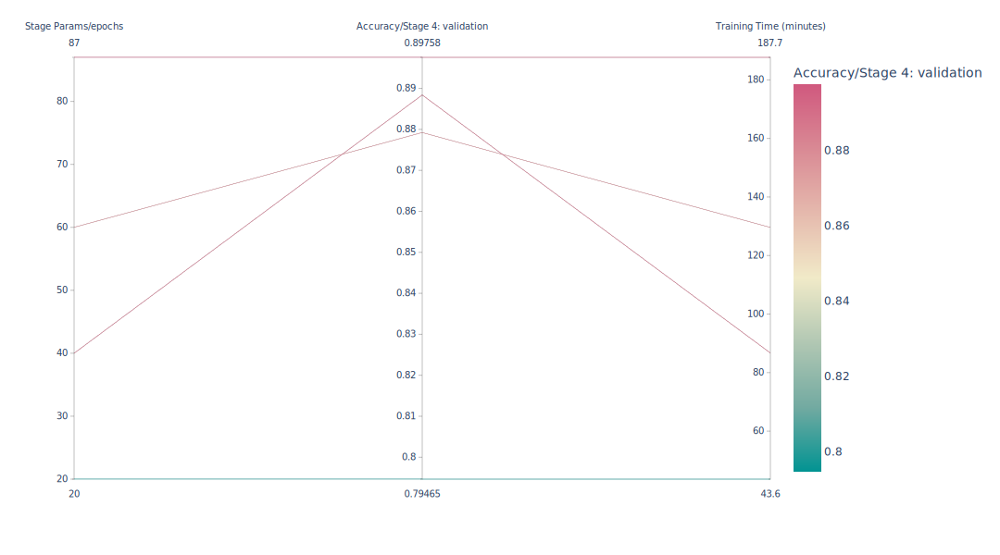
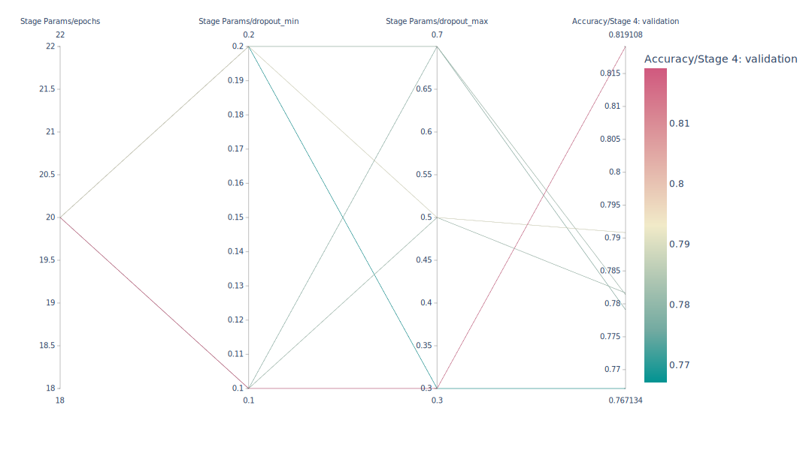

# Reproduce and Evaluate - EfficientNetV2: Smaller Models and Faster Training
In Machine Learning the topic of reproducibility has become highly relevant, given the need for sustainable and reusable innovation. The following blog post and corresponding repository present our reproducibility research procedure regarding the EfficientNet-V2 convolution network originally presented by Mingxing Tan and Quoc V Le in their work "_[EfficientNet V2: Smaller Models and Faster Training](https://paperswithcode.com/paper/efficientnetv2-smaller-models-and-faster)_". The novel approach presented in the work employs progressive learning to achieve speed up and efficient process.

We focus our exploration on three main parts: (1) reproducibility of results shown in the paper using the ImageNetTE dataset; (2) hyperparameter sensitivity of the progressive learning elements; (3) transferability of performance on different datasets. Every component of our study is executed individually using the PyTorch implementation ([pytorch/vision](https://github.com/pytorch/vision)) combined with ClearML. In the next sections, we outline the details of every step of our process starting with the introduction of the paper, experiments, and finishing with conclusions and relevant links.

_Disclaimer:_ This project is created as part of the Deep Learning course CS4240 at the TU Delft.

# Authors
Three people contributed to the creation of this project:

- Karel van de Vrie [k.w.vandevrie@student.tudelft.nl] [5658756] - PyTorch implementation enrichment with stages, reproducibility, ClearML implementation
- Nikoletta Nikolova [n.d.nikolova@student.tudelft.nl] [4457757] - Hyperparameters sensitivity, analysis and experimentation
- Anna-Maria Klianeva [a.v.klianeva@student.tudelft.nl] [4837010] - Alternative datasets experiments and performance evaluation
 
# Table of Content

- [Introduction](#introduction)
    - [EfficientNetV2?](#efficientNetV2)
    - [Progressive Learning](#progressive-learning)
- [Reproducibility](#reproducibility)
    - [Progressive Learning Stages](#progressive-learning-stages)
    - [Training on TE](#training-on-te)
    - [Results](#results)
- [Hyperparemeters](#hyperparameters)
    - [Epochs](#epochs)
    - [Dropout Limits](#dropout-limits)
    - [Image Size](#image-sizes)
- [Alternative Data](#alternative-dataset)
    - [Pneumonia - Chest X-Ray Images dataset](#Pneumonia---Chest-X-Ray-Images-dataset)
    - [ Ants and Bees - the Hymenoptera dataset](#ants-and-bees---the-hymenoptera-dataset)
    - [Monkey Species dataset](#Monkey-Species-dataset)
- [Implementation using ClearML](#implementation-using-clearml)
- [Conclusions](#conclusion)
- [References](#References)
- [Relevant Links](#relevant-links)

# Introduction
In their work, Mingxing Tan and Quoc V. Le (2021) [9] present a new variation of the EfficientNet [11] network, which is considered to be faster and more efficient than its predecessors. 

## EfficientNetV2

The EfficientNetV2 is a convolutional neural network, which is built with improvements, which aim to address the set of bottlenecks originally present within the EfficientNet network. The new structure makes use of MBConv [10],[11] and fused-MBConv [12]. 

The original network is trained on ImageNet using 4 stages, of 87 epochs each, with batch size of 4096, learning rate warmed up from 0 to 0.256 (and then decay by 0.97 every 2.4 epochs), Image size of 128 to 300, the dropout rate of 0.1 to 0.3, random augmentation of 5 to 15. (For more details on the exact parameters, please consult the original paper [9])

## Progressive learning
Progressive Learning is a training method proposed by the authors of EfficientNetV2. It splits the training process into separate stages, each of which has a certain set of hyperparameters. The aim is to provide a start with reduced image size and low regularization parameters (such as dropout) and gradually scale them up with every next stage. This allows the training to be sped up and provides the network with different learning settings at every stage. It is a central element of the EfficientNetV2 structure, which is why it is the main focus of our reproducibility project explained in the next sections.

# Reproducibility
To be able to try and reproduce the results of the original paper we chose to use the official implementation of EfficientNetV2 from PyTorch, this implementation allows for using pre-trained weights or training from scratch and setting the dropout rate. While this framework provided a detailed code structure and working examples, we noticed that it was missing complete implementation of the progressive learning process that the paper originally applies. The code was lacking the ability to add the different stages and change the parameters corresponding to them (see Table 6 from the [paper](https://arxiv.org/pdf/2104.00298.pdf)). 

## Progressive Learning Stages
There is no direct way to train in stages when using PyTorch, thus we had to write our own code. While the data loaders could be changed while training the network, the dropout rate is set when importing the model architecture. This prevented us from running a single training for all the stages. To overcome this we link independent training's together as you would with transfer learning. At the end of every stage the weights are written to file, the previous training stage is destroyed thus freeing the GPU VRAM, and the next training stage is started by recreating the network using the PyTorch EfficientNetV2-S architecture with the new dropout rate and loading the weights of the previous stage into this. For every stage, the current value of the variable parameters is calculated and the data loader for that stage is created.

## Training on TE

We trained on an NVIDIA GPU 3090TX using the [ImageNetTE](https://github.com/fastai/imagenette) dataset, which is significantly smaller than ImageNet and contains the 10 easily classified classes. This is because training the whole ImageNet and ImageNet21K would take too much memory and way too much time for this subject. We tried to use the same hyperparameters as the original EfficientNetV2 paper used, however not all parameters have an equivalent in PyTorch, and specifically, the weight decay made things worse, and thus was left out.

## Results

The training and validation accuracy for the different stages is shown in the **interactive figure** below:


What can be observed is that with every stage the network becomes more accurate, however, there is a significant difference between the training and validation accuracies showing that the network overfits a little. Additionally, stage 4 doesn't seem to add a lot to this training, indicating that the hyperparameters, specifically regularization, will need tuning. Alternatively, it shows that the 4th stage is not required thus saving time and network bandwidth by enabling a smaller image size.

While the paper notes an accuracy of 83.9% when trained on ImageNet and 84.9% when trained on ImageNet 21k, we achieve an accuracy of 89.75% on a smaller subset of ImageNet. The achieved results indicate that what the authors originally show in the paper appears to be credible. The rise in accuracy can be explained by the chosen dataset. When comparing to the top results of ImageNetTE we fall short, the top result is 95.11% [8] whereas ours is 89.7%. 

# Hyperparameters
When it comes to hyperparameters, the most interesting components for investigation are the ones, which are part of the progressive learning process. More specifically, we look at epochs per stage, dropout limits, and image sizes. 

## Epochs
The first hyperparameter we consider is the number of epochs per stage. The original EfficientNetV2 paper promotes a fast and efficient process. Therefore, it is interesting to consider whether the model can achieve comparable accuracy with fewer epochs. This would look for the gain of accuracy per minute of training time. With fewer epochs there is less training time, which can also correspond to less accuracy, however, the differences can be significant.

- Original settings: [87] epochs per stage
- Test parameters: [20, 40, 60] epochs per stage

<!--  There are too many webgl elements so changed with images -->

The results in the image above show that more epochs increase the training time significantly. What is interesting to note is that with 40 epochs the network appears to be performing 0.08% better compared to the one of 60 epochs, while there is 39 minutes less training. That would show that the 40 epoch appears to be the most optimal choice from the tests.

## Dropout Limits
To assess the sensitivity of the network to the dropout limits, 5 different tests are performed, where for each test the network is trained in 4 stages, each consisting of 20 epochs. This way we can assess how the different ranges of adaptive regularization influence the overall performance. 

- Original settings: min = [0.1], max = [0.3]
- Test parameters: min = [0.1, 0.2], max = [0.3, 0.5, 0.7]

<!--  There are too many webgl elements so changed with images -->

The dropout limits tested show interesting results, as the 0.1-0.3 duo, originally used in the paper, is the one that also performs best. This means, that from the chosen ranges, it is the most optimal and thus with the highest accuracy. Outside of that, we can see that a bigger range between the min and max dropout performs better than lower (0.2-0.3 performs worst, whereas 0.2-0.7 and 0.1-0.5 perform similarly). It would be interesting to explore further if those results would still hold through iterations over multiple random seeds, as the current test results are acquired by training on the same random seed. 

## Image Sizes
The paper claims, that "_the training can be further sped up by progressively increasing the image size during training time_". To evaluate this and the overall sensitivity of the network to the image size limits, 5 different tests are performed, where for each test the network is trained in 4 stages, each consisting of 20 epochs. As the progressive increase of image size is crucial to the claims of the paper we take a special look at the speed and accuracy of the different trainings. 

- Original Settings: min = [128], max = [300]
- Test Parameters: min = [128,200], max = [200, 300]



<!--The authors of the paper note that the progressive increase of image size can cause a drop in accuracy which, as can be seen in our results, is ...-->

One thing that we can observe from the results in the **interactive figure** above is that lowering the higher limit of the image size to 200 does seem to impact negatively the accuracy. Another point concerns the higher limits - if we up the first stage image size to 200 and keep the higher limit the same, the achieved accuracy improves. This is possibly due to the increased information content compared to the original setting. Those changes, however, appear to affect the  time required to train the network. As expected, smaller-sized images require less time to train. 

# Alternative Datasets
To further evaluate how well *Efficientnet_v2_s* maintains its performance on new data, we perform experiments with three different datasets. The *Efficientnet_v2_s* model is imported from torchvision.models and the pre-trained weights are used unless when specifically mentioned otherwise. 

## Pneumonia - Chest X-Ray Images dataset
The use of Deep Learning (DL) in medicine is becoming increasingly popular [1]. One important application is the use of DL for disease detection. Thus, the dataset Chest X-Ray Images (Pneumonia) [2] is used. This dataset X-ray images of a normal chest, as well as X-ray images of a chest with bacterial and viral pneumonia. The images are split into two classes: Normal and Pneumonia. We test the *Efficientnet_v2_s* with different hyperparameter sets, shown in the table below.

- Learning rate - [0.001-0.03]
- Batch size - [10, 20, 30]
- Epochs - [10, 15, 20, 30]

The validation accuracy for different combinations of hyperparameters is shown in the **interactive figure** below:



The best performance of *Efficientnet_v2_s* with the dataset leads to an accuracy of 75% on validation data and 90% on training data. This is somewhat lower than the results of Aakashnain (2018) where a validation accuracy of 82.6% was reached using Depthwise Convolution and the results of Madz2000 (2020) where 87.5% accuracy was achieved using a Convolutional Neural network. 

## Ants and Bees - the Hymenoptera dataset
For a broader spectrum of testing, we also use a very small dataset - the Hymenoptera dataset [5]. This dataset only contains 398 images in two classes: ants and bees. For this dataset, different hyperparameters are tested and shown in the table below: 

- Learning rate - [0.006 - 0.02]
- Batch size - [10, 20, 30]
- Epochs - [50, 75, 100]

Furthermore, the effect of retraining the weights of the model was evaluated for those hyperparameters. The validation accuracy for different combinations of hyperparameters is shown in the **interactive figures** below:

Training from scratch:


Transfer learning:


As could be seen by the results above, the best validation accuracy for the given hyperparameters with *Efficientnet_v2_s* for the dataset is 75% when the weight is trained from scratch versus 69.9 % when the pre-trained weights are used. This shows that training with randomly initialized weights leads to better results when working with this dataset. It should be noted that the best validation performance of 94% was achieved using ResNet-18 with pre-trained weights [6].

## Monkey Species dataset
Lastly, we use the 10 Monkey Species dataset [7]. The dataset contains 1400 images of 10 classes: mantled howler, patas monkey, bald uakari, Japanese macaque, pygmy marmoset, white-headed capuchin, silvery marmoset, the common squirrel monkey, black-headed night monkey, and Nilgiri langur. The set of parameters is shown in the table below.

- Learning rate - [0.0001 - 0.1]
- Batch size - [10, 20, 30]
- Epochs - [15, 20, 30, 40, 50]

The validation accuracy for different combinations of hyperparameters is shown in the **interactive figure** below:



What is interesting about this dataset, is that the best-achieved validation accuracy is only 57.3%, which is significantly lower than the original results or the other two used datasets. 

# Implementation using ClearML
ClearML is a machine learning operations platform that helps data scientists and machine learning engineers manage, track, and collaborate on their machine learning experiments and models. It provides a wide range of features such as experiment tracking, model management, and data versioning, that can help to streamline the machine learning development process. It also allows for easy collaboration between team members and helps to ensure that experiments and models are reproducible. 

We use ClearML to track our experiments and to run hyperparameter optimization tasks. Tasks get assigned to queues, these queues can have workers which will run the tasks. A hyperparameter optimization task will take a base task and optimize the hyperparameters, these parameters can be deterministically or uniformly specified. For every combination of parameters, a task will be created and assigned to the queue. Once all tasks have been run the hyperparameter optimization task creates a summary with clear graphs such as seen above. 

# Conclusion
Overall, the experiments we performed show promising results both in reproducing and hyperparameter sensitivity. We were able to achieve a similar accuracy on a given ImageNet dataset using the progressive learning components defined in the paper. Furthermore, our analysis of the hyperparameters of interest shows that the dropout range can highly influence the performance of the network, and the epochs/image size affects the total time of the training. What is particularly interesting is the behavior of the EfficientNetV2 on new data - while we expected that by using transfer learning we would be able to achieve high accuracy on different types of data sets, the results do not seem to be as high. It would be worthwhile for future work to further explore how the network behaves with a higher variety of datasets so that the quantitative analysis can be completed. Furthermore, it would be useful to compare how the network behaves with and without stages, when trained using the same parameters, as this would strengthen the story regarding the benefits of using stages.

# References
[1] Egger, J., Gsaxner, C., Pepe, A. and Li, J. (2022). Medical deep learning—A systematic meta-review. Computer Methods and Programs in Biomedicine, [online] 221, pp.106874–106874. doi:https://doi.org/10.1016/j.cmpb.2022.106874.

[2] Mooney, P. (2018). Chest X-Ray Images (Pneumonia). [online] Kaggle.com. Available at: [https://www.kaggle.com/datasets/paultimothymooney/chest-xray-pneumonia](https://www.kaggle.com/datasets/paultimothymooney/chest-xray-pneumonia) [Accessed 26 Apr. 2023].

[3] Aakashnain (2018). Beating everything with Depthwise Convolution. [online] Kaggle.com. Available at: [https://www.kaggle.com/code/aakashnain/beating-everything-with-depthwise-convolution](https://www.kaggle.com/code/aakashnain/beating-everything-with-depthwise-convolution) [Accessed 26 Apr. 2023].

[4] Madz2000 (2020). Pneumonia Detection using CNN(92.6% Accuracy). [online] Kaggle.com. Available at: [https://www.kaggle.com/code/madz2000/pneumonia-detection-using-cnn-92-6-accuracy](https://www.kaggle.com/code/madz2000/pneumonia-detection-using-cnn-92-6-accuracy) [Accessed 26 Apr. 2023].

‌[5] Tensorflow Notebooks (2022). Hymenoptera dataset. [online] Kaggle.com. Available at: [https://www.kaggle.com/datasets/tensorflownotebooks/hymenoptera-dataset](https://www.kaggle.com/datasets/tensorflownotebooks/hymenoptera-dataset) [Accessed 26 Apr. 2023].

[6] Tensorflow Notebooks (2022). Transfer Learning for Computer Vision Tutorial. [online] Kaggle.com. Available at: [https://www.kaggle.com/code/tensorflownotebooks/transfer-learning-for-computer-vision-tutorial](https://www.kaggle.com/code/tensorflownotebooks/transfer-learning-for-computer-vision-tutorial) [Accessed 26 Apr. 2023].

‌[7] Mario (2018). 10 Monkey Species. [online] Kaggle.com. Available at: [https://www.kaggle.com/datasets/slothkong/10-monkey-species](https://www.kaggle.com/datasets/slothkong/10-monkey-species) [Accessed 26 Apr. 2023].

‌[8] Howard, J. (2022), ImageNetTE. Available at: [https://github.com/fastai/imagenette](https://github.com/fastai/imagenette) [Accessed 26 Apr. 2023]
‌
[9] Mingxing Tan and Quoc V. Le (2021), EfficientNetV2: Smaller Models and Faster Training, [online] 139, pp.10096-10106. doi:[https://doi.org/10.48550/arXiv.2104.00298](https://doi.org/10.48550/arXiv.2104.00298).

[10] Sandler, M., Howard, A., Zhu, M., Zhmoginov, A., and Chen, L.-C. Mobilenetv2: Inverted residuals and linear bottlenecks. CVPR, 2018

[11] Tan, M. and Le, Q. V. Efficientnet: Rethinking model scaling for convolutional neural networks. ICML, 2019a.

[12] Gupta, S. and Tan, M. Efficientnet-edgetpu: Creating accelerator-optimized neural networks with automl. [https://ai.googleblog.com/2019/08/efficientnetedgetpu-creating.html](https://ai.googleblog.com/2019/08/efficientnetedgetpu-creating.html), 2019.
‌
# Relevant Links

- Our reproducibility: [https://github.com/KarelvdVrie/EfficientNet-V2_Reproducibility-CS4240](https://github.com/KarelvdVrie/EfficientNet-V2_Reproducibility-CS4240)
- Original paper: [https://arxiv.org/pdf/2104.00298.pdf](https://arxiv.org/pdf/2104.00298.pdf)
- Papers with code: [https://paperswithcode.com/paper/efficientnetv2-smaller-models-and-faster](https://paperswithcode.com/paper/efficientnetv2-smaller-models-and-faster)
- PyTorch implementation: [https://pytorch.org/vision/main/models/generated/torchvision.models.efficientnet_v2_s.html#torchvision.models.efficientnet_v2_s](https://pytorch.org/vision/main/models/generated/torchvision.models.efficientnet_v2_s.html#torchvision.models.efficientnet_v2_s)
- ImageNetTE: [https://github.com/fastai/imagenette](https://github.com/fastai/imagenette)
